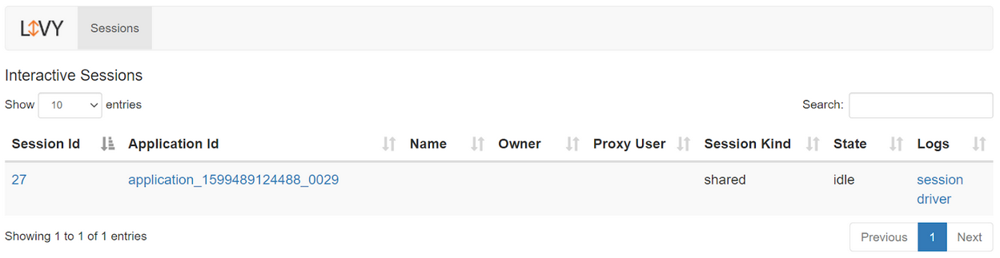
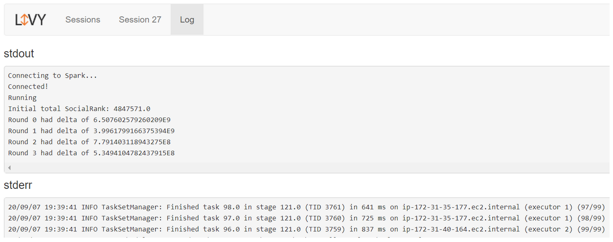
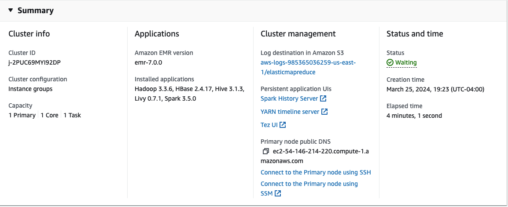
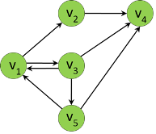

[](https://classroom.github.com/a/696qirBB)
# Homework 3: Graph Analysis over Social Data on the Cloud

## Milestone 2: SocialRank in Spark

**Deadline: Monday 04/01/2024 @11:59 PM**

## Overview

For this milestone, you will be enhancing your Apache Spark RDD skills to do social network analysis. You will be working with the same IMDb dataset as you did in HW2 and HW3MS1, but now we will be providing the "friends" data file. We'll start with implementing and running a SocialRank algorithm locally, and then we'll scale up and move on to Amazon Elastic MapReduce.
By the end of this assignment you'll:

- Be comfortable with the more advanced operations on RDDs, including unions, joins, and distinct; and with going between PairRDDs and regular RDDs.
- Understand how to do iterative computations in Apache Spark.
- Understand how to implement the SocialRank algorithm.
- Be able to launch jobs on Amazon Elastic MapReduce.

## Setup

### Clone the Code

Once you accept the GitHub Classroom assignment, you will have a private repository with the
name `homework-3-ms2-{myid}`. This repository contains the starter code for the assignment. **Change `{myid}` to your
PennKey.**

Here is how you will check out the `homework-3-ms2` to your machine:

1. Navigate to the GitHub repository of _your_ homework3-ms2-{myid} assignment.
2. Click the green Code button and copy the SSH link.
3. Open up your local terminal/command-line interface and `cd` to `~/nets2120`. (On
   Windows: `cd %userprofile%\nets2120`).
4. Clone the repository by running `git clone <ssh link> homework-3-ms2-{myid}`. This should create a new
   folder `homework-3-ms2-{myid}` with the contents of the repository inside your `nets2120` directory.

### Launch Docker

1. Launch the Docker Desktop app.
2. Open up a terminal window
3. Enter: `docker start nets2120`
4. Enter: `docker exec -it nets2120 bash`. This should enter you into the docker shell.

## MS2 Part 0: Spark on Elastic MapReduce

In the first milestone you wrote Spark programs...  But they actually didn't provide much benefit over Java Streams, because they were run  on a single node (your Docker container `localhost`).  Here's how to actually launch a compute cluster in the cloud! **Note that you should read over this before you start on your Milestone 2 programming to understand what lies ahead -- but you probably should wait to actually launch the cluster until Milestone 2 Part 2.**

**Creating a cluster.**
Launch an Elastic MapReduce cluster in `us-east-1`. As usual, start a Lab session in AWS Academy's Canvas, then click on "AWS" (with the
green circle next to it) to open the AWS console, and look up EMR; then
click the "Create Cluster" button. For the zone, specify
`us-east-1` (N. Virginia). Configure your cluster as follows:

-   In "Amazon EMR release", choose `emr-7.0.0`
-   In "Application bundle", leave "Spark Interactive" highlighted
-   Select Spark 3.5.0, Hadoop 3.3.6, HBase 2.4.17, Hive 3.1.3, and Livy 0.7.1.
-   Leave the instance types with the defaults.

Depending on the zone you use, the version numbers you will see may be
slightly different; if so, choose the nearest equivalent.

Under "Security configuration and EC2 key pair", select from the dropdown
the same .pem file you used for your tunnel node.  You may need to tunnel
to the EMR coordinator to access various services.

Under "Amazon EMR Service Role" you'll need to choose an existing service
role, and select `EMR_DefaultRole`.  Under "EC2 instance profile for Amazon EMR", choose `EMR_EC2_DefaultRole`.  Click on `Create cluster` -- if you
filled everything in as per above, it should start creating the cluster.

After some time, you should have a running cluster. *Please make sure you shut it
down when you are done, as it will spend your AWS credits fairly quickly
if you let it go to the 4 hour timeout!* Once your cluster is terminated, it will show up on the
EMR console, and you can always select it and then clone it to create
another, similar cluster. (The new one will have a different IP address
and domain name, but will inherit your changes to the security /
firewall settings.)



### Jobs on EMR and Livy

There are multiple ways to submit a Java job to Elastic MapReduce and to
Spark. We will be using Apache Livy, which allows us to submit via a
REST interface a Java JAR file to be run, and which allows monitoring.
If you go to the Amazon EMR console and click on your cluster, then the "Applications" tab, then
"Application user interfaces", you should find the URL for Livy, ending
in `:8998`. Copy and paste that in the browser, and you should get a
list of what's running, such as the one in
Figure [1]. Importantly,
if you click on the "session" link, you should be able to see your
messages written to standard output (`System.out.println`) and standard
error (`System.err.println`), as shown in
Figure [2]. This will be
really helpful when you are running jobs!



### Considerations When Running on EMR

When you want to run an Apache Spark job on EMR, unfortunately it's not
as simple as launching the job in VS Code. Instead, you need to create a
jar file with your task (more on this later), and you need to upload and
send that to EMR. Moreover, if your code depends on external libraries
you'll need to either make sure these are already installed on EMR, or
you need to build a "fat jar" that includes all dependencies.

For our purposes, you can use `mvn package` to create the jar file from
your VS Code directory. (You can run this from within VS Code, but it's
probably just as easy to do this from the Terminal.) This should create
a file called `target/nets2120-hw3-0.0.1-SNAPSHOT.jar`.

There are AWS command line tools you can install, but perhaps it's
better to *programmatically* load the job. We'll be using the Apache
Livy libraries so we can write a Java program that sends the jar file to
Apache Spark on EMR, waits for it to return results, and prints those
results.

### Setting up the Tunnel
In order to send jobs to livy, you will need to set up SSH tunneling. 

Edit this command, setting the `public DNS` (it should be a single line):

```
ssh -i ~/.ssh/tunnel.pem -L 8998:localhost:8998 hadoop@publicDNS
```

As an example, here is a version that worked for us:

```
ssh -i ~/.ssh/tunnel.pem -L 8998:localhost:8998 hadoop@ec2-54-146-214-220.compute-1.amazonaws.com
```

Note that this DNS is from the EMR cluster, and is different from the DNS for the tunnel server. 



## MS2 Part 1: Basic SocialRank Implementation

Your first task is to write the Java Spark code in `ComputeRanks`, which takes the social network from `Config.SOCIAL_NET_PATH` and computes, for each node, its SocialRank.  The IMDb dataset is small enough that you can (with some patience) compute SocialRank from a single-node Spark cluster, i.e., your laptop.  `ComputeRanks` is designed to be runnable locally (see [ComputeRanksLocal](src/main/java/edu/upenn/cis/nets2120/hw3/local/ComputeRanksLocal.java)) and from Livy (see [ComputeRanksLivy](src/main/java/edu/upenn/cis/nets2120/hw3/livy/ComputeRanksLivy.java)).

### SocialRank Essentials

SocialRank is very similar to PageRank, except that it operates on social network graphs instead of hyperlink graphs. You may wish to refer to your notes on PageRank and its Spark implementation. However, we summarize the essentials here.

Let $G=(V,E)$ be a social network graph, where each vertex $v\in V$ represents an individual user and each edge $(v_1, v_2)\in E$ represents the fact that user $v_1$ follows user $v_2$.  Note that following links are not necessarily reciprocal: if user $A$ follows $B$, that does not necessarily mean that $B$ follows $A$. The goal of SocialRank is to assign a rank $r_i$ to each vertex $v_i$; the higher the rank value, the more "influential" this algorithm considers the person (or page) to be.

SocialRank is an iterative algorithm, that is, it consists of several rounds. Let $r_i^k$ be the rank of vertex $i$ in round $k$. Before the first round, all ranks are initialized to one, that is, $\forall i: r_i^0 = 1$. Given the ranks of round $k$, the ranks for round $k+1$ are calculated using the following formula:
$$r_i^{k+1} = d + (1-d)\cdot \sum_{j\in B(i)} \frac{1}{|N(j)|} \cdot r_j^k$$
where the decay factor $d$ is a constant (we will use $d=0.15$), $N(i):=\{j\,|\,(i,j)\in E\}$ is the set of users/vertices whom $i$ follows, and $B(i):=\{j\,|\,(j,i)\in E\}$ is the set of users/vertices that follow $i$. The formula works basically the same way as PageRank: in each iteration, each node divides up its rank equally among its outgoing edges (hence the $\frac{1}{|N(j)|}$ factor), "sends" a part over each outgoing edge, and then adds up the ranks it "receives" over the incoming edges (hence the sum over $B(i)$). The algorithm stops when all the ranks have converged, i.e., when $|r_i^k-r_i^{k-1}|$ is small for all $i$.

### A Simple Example



Your algorithm will run on a data set that is too large for debugging because a) each run will take a long time, and b) we do not know up front what the correct answer should be. Therefore, we begin with the simple example shown on the right, which consists of just five vertices. In this example, $V=\{1,2,3,4,5\}$ and $E=\{(1,2),(1,3),(2,4),(3,1),(3,4),(3,5),(5,1),(5,4)\}$. If we set $d=0.15$ and run a single round of SocialRank, we get the following:

| i       | 1     | 2     | 3     | 4     | 5     |
|---------|-------|-------|-------|-------|-------|
| $r_i^1$ | 0.858 | 0.575 | 0.575 | 1.708 | 0.433 |

For instance, $v_1$ has two incoming edges, from $v_3$ and $v_5$; it receives $1/3$ from $v_3$ (since $v_3$ had rank $r_3^0=1$ at the beginning and has $|N(3)|=3$ outgoing edges) and $1/2$ from $v_5$ (since $v_5$ also had rank $r_5^0=1$ and has $|N(5)|=2$ outgoing edges), so its new rank is $r_1^1=0.15+0.85\cdot (\frac{1}{3}+\frac{1}{2}) \approx 0.858$.

If we run the algorithm until the ranks for all the vertices change by less than $0.001$ compared to the previous round, we arrive at round $11$ and the following values:

| i          | 1     | 2     | 3     | 4     | 5     |
|------------|-------|-------|-------|-------|-------|
| $r_i^{11}$ | 0.331 | 0.291 | 0.291 | 0.579 | 0.233 |

Not surprisingly, the user represented by vertex $4$ is returned as the most influential.

### The IMDb Friends Graph

The data in the social graph (which comes from the "friends" table from HW2) consists of a list of edges with the IDs of the nodes, *(follower followed)*. In this edge list representation, the graph from above would be encoded as shown in the table below:

```
    1 2
    1 3
    2 4
    3 1
    3 4
    3 5
    5 1
    5 4
```

The two numbers on each line could be separated either by spaces or by a tab character; your code should be able to handle both cases.

### Computing SocialRank for the IMDb Network

As a first step, you should implement SocialRank for the IMDb network and compute its SocialRank. Update `edu.upenn.cis.nets2120.hw3.ComputeRanks` to load the data from `Config.SOCIAL_NET_PATH` into an RDD.  Do the following:

* Output *This graph contains [xxx] nodes and [yyy] edges*, where `[xxx]` and `[yyy]` are replaced with the actual values. Note that the same edge may appear more than once. Use the `.distinct()` function to eliminate duplicates.
* For any node $n$ that is a `sink` (that is, has no outgoing edges), add a backlink to each node that links to $n$.
* Output *Added [zzz] backlinks*, where `[zzz]` is replaced with the actual value.
* Initialize the SocialRank with a value of 1 at all nodes.
* Use a decay factor of $0.15$.
* Compute the SocialRank after either the largest change in a node's rank from iteration $i$ to iteration $i+1$ is $d_{max}$, or after $i_{max}$ iterations have passed -- whichever comes sooner.
* Output the top 1000 node IDs with the highest SocialRank values, as well as the SocialRank value of each. The output should consist of 1000 lines of the form *x y*, where `x` is a node ID and `y` is the socialRank of `x`; the lines should be ordered by SocialRank in descending order. Write this to a file called `socialrank-local.csv` (this should be in your project's root directory).

Your program will be given up to three command-line arguments:

* Double $d_{max}$, which defaults to $d_{max}=30$.
* Integer $i_{max}$, which defaults to $i_{max}=25$.
* Boolean `debug`, which should tell your program to enter a `debug mode` in which it outputs a list of node IDs and their SocialRanks to the terminal after each round. The format should be the same as that of the final output, except that it should include all the nodes, in any order, not just the top-1000. If `debug = false`, do not enter `debug mode`.

You can run the program from the command line as `mvn exec:java@local`. You can specify arguments using `-Dexec.args` as follows: 
```
mvn exec:java@local -Dexec.args="arg1 arg2 arg3"
```

**Environment.**
You will also want to set up an *environment* for your program to run, giving it the AWS credentials.
Create a file called `.env` (not to be checked into GitHub; already added to `.gitignore`) that sets environment variables that your Java program will be able to read.  It should look like this:

```
export AWS_ACCESS_KEY_ID=...
export AWS_SECRET_ACCESS_KEY=,,,
export AWS_SESSION_TOKEN=...
```

where you copy the contents of your AWS Details from Academy (the ones that by default you would put into .aws/credentials).  Note the use of uppercase above.  Run `source .env` from your Docker command line.

**A few hints.** You'll likely want to use both `JavaRDD` (for sets of single items like nodes) and `JavaPairRDD` (for edges, ranks, etc) in this assignment.  If you have two `JavaPairRDD`s with compatible keys, you can call `rdd1.join(rdd2)` to return a new RDD, whose keys represent the keys in common between the two RDDs, and whose values are pairs of values from the input RDDs.  In a few cases you'll want to use union to combine RDDs with the same structure, and distinct to remove duplicates.  

The task of finding sink nodes can be done several ways.  There is an RDD subtract but in fact there is another way that only makes sense of the above constructs, and counting.

The idea of doing this locally first is to make sure that your algorithm works correctly. Start with the very simple example above (it is included as [simple-example.txt](src/main/java/edu/upenn/cis/nets2120/hw3/simple-example.txt)), where you can check the computation by hand if necessary, and then run it with the *new* IMDb data provided to make sure your computation works at scale. You should move on to the next step only once you have confidence in your algorithm; after this point, there will no longer be an easy way to check whether your output is correct. (This is very common for "big data" tasks.)

## MS2 Part 2: Scaling Up - SocialRank

### Expanding your code: SocialRank

This is the same process as Part 1, just with the SocialRank "driver" program, `ComputeRanksLivy`. 

Launch your EMR cluster as per the initial instructions. Update your .env file to add an entry:

```
export LIVY_HOST=...
```

with the URI to correspond to your server that you found under "Application user interfaces" in Part 0. 

Note that the
code calls `client.submit()` with a new object of class `SocialRankJob`.
The `SocialRankJob` will actually be invoked on the remote Apache Spark
nodes, with the appropriate parameters we are passing in. Its results
will be collected from all nodes, and returned when the `.get()`
function returns.

Take your `ComputeRanks` code, and use it to flesh out
`SocialRankJob`. Make the following changes:

1.  Replace all calls to the logger with calls to `System.out.println`
    or `System.err.println`. Livy will collect these, so you can see
    them.

2.  Eliminate every `shutdown()` because Spark will happily
    terminate the job by itself.

At the end of the `run()` method, you should take the social rank data,
sort it from highest to lowest SocialRank, and return a list of the
top-10-scoring nodes and their social ranks. This should be similar to how you implemented `ComputeRanks.java`, but here you are taking only the top 10 instead of the top 1000. Return this as a
`List<MyPair<String,Double>``>` rather than
`List<Tuple2<String,Double>``>`. The latter does not properly get sent back to your driver.

### What about back-links?

Once you have the previous part working, you are ready to compare the results of SocialRank with and without
back-links added.

You'll note that `SocialRankJob` had a parameter called `useBacklinks`.
Implement some logic to add backlinks when that is passed in with value
`true`, and not add the backlinks when it's `false`.

In `ComputeRanksLivy.java`, add a second call to Apache Livy to run a SocialRankJob with the
back-links set to `false`. Write the output to a file named `socialrank-livy-nobacklinks.csv` (this should be in your project's root directory). 

Now compare the two sets of returned top-10
results (from the IMDB friends data) where the values of $d_{max}$ and
$i_{max}$ are set to their defaults, and write the following to a file
called `socialrank-livy-results.txt` (this should be in your project's root directory), in three separate lines:

-   A list of node IDs, separated by commas, for nodes in common between
    the two top-10 lists.
    

-   A list of node IDs, separated by commas, for nodes exclusive to the
    computation with back-links.

-   A list of node IDs, separated by commas, for nodes exclusive to the
    computation without back-links.

The node IDs within each of these lists can be in any order. Put a label
at the beginning of each list, i.e. \"Nodes in both lists:\".


## Running Your Solution

- Compile: `mvn compile`
- Run `ComputeRanksLocal.java` file: `mvn exec:java@local`
- Create a .jar file for livy: `mvn package`
- Run `ComputeRanksLivy.java` file: `mvn exec:java@livy`
- Clean Project: `mvn clean`

## Grading

This assignment is out of 100 points.

- 95 points: Auto-graded tests
- 5 points: Completion of [`feedback.yaml`](feedback.yaml)

## Submission

The files containing TODOs are:

- [`ComputeRanks.java`](src/main/java/edu/upenn/cis/nets2120/hw3/ComputeRanks.java)
- [`ComputeRanksLivy.java`](src/main/java/edu/upenn/cis/nets2120/hw3/livy/ComputeRanksLivy.java)
- [`SocialRankJob.java`](src/main/java/edu/upenn/cis/nets2120/hw3/livy/SocialRankJob.java)

Also, add to your GitHub repo the final versions of:

- `socialrank-livy-backlinks.csv`
- `socialrank-livy-nobacklinks.csv`
- `socialrank-livy-results.txt`
- `socialrank-local.csv`

in the root directory of your hw3-ms2 project.

Submit your entire repo via [Gradescope](https://www.gradescope.com/courses/677230) by uploading
from GitHub. You may need to link your GitHub account if prompted. Don't forget to fill out
the [reflection questions](feedback.yaml) before you submit.
